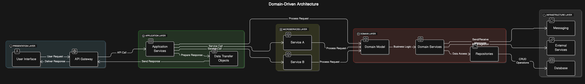

# Scarlet Vertigo Ecommerce API

### Architecture Overview



### Version Control Flow


### Folder Structure

```bash
src
├── api
│   ├── controllers
│   │   ├── auth.ts
│   │   ├── cart.ts
│   │   ├── category.ts
│   │   ├── news.ts
│   │   ├── order.ts
│   │   ├── product.ts
│   │   ├── size.ts
│   │   └── userForm.ts
│   ├── middlewares
│   │   ├── admin.ts
│   │   └── user.ts
│   └── routes
│       ├── auth.ts
│       ├── cart.ts
│       ├── category.ts
│       ├── news.ts
│       ├── order.ts
│       ├── product.ts
│       ├── requestForm.ts
│       └── size.ts
├── config
│   ├── fileUpload.ts
│   └── swagger.ts
├── constants
│   ├── order-status.ts
│   └── role.ts
├── domain
│   └── services
│       ├── cart.service.ts
│       ├── category.service.ts
│       ├── form.service.ts
│       ├── image.service.ts
│       ├── new.service.ts
│       ├── order.service.ts
│       ├── product.service.ts
│       ├── size.service.ts
│       └── user.service.ts
├── infrastructure
│   ├── models
│   │   ├── RequestForm.ts
│   │   ├── cart-product.ts
│   │   ├── cart.ts
│   │   ├── category.ts
│   │   ├── image.ts
│   │   ├── news.ts
│   │   ├── order-product.ts
│   │   ├── order.ts
│   │   ├── product-size.ts
│   │   ├── product.ts
│   │   ├── size.ts
│   │   └── user.ts
│   └── repositories
│       ├── cart.repository.ts
│       ├── category.repository.ts
│       ├── form.repository.ts
│       ├── new.repository.ts
│       ├── order.respository.ts
│       ├── product.repository.ts
│       ├── size.repository.ts
│       └── user.repository.ts
├── main.ts
├── types
│   └── express
│       └── index.d.ts
└── utils
    ├── ApiError.ts
    └── ApiResponse.ts
```
